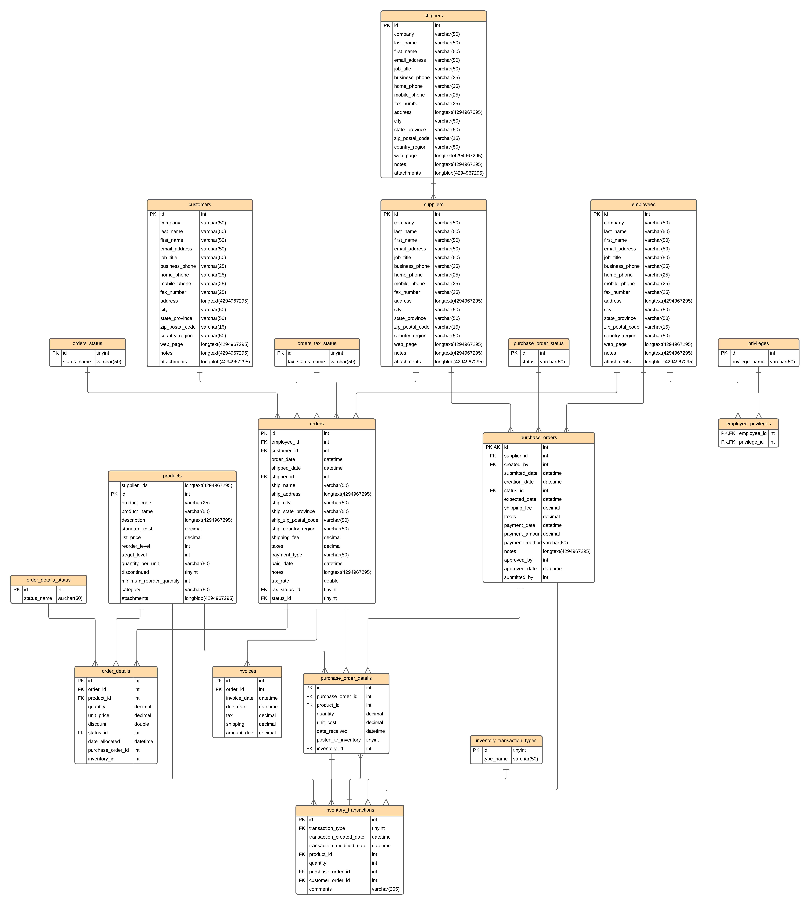
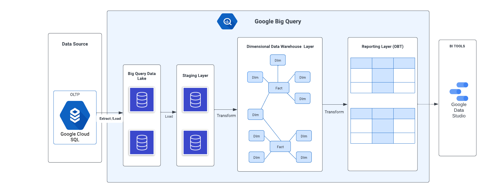
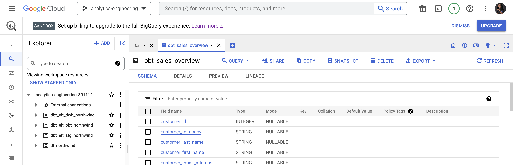
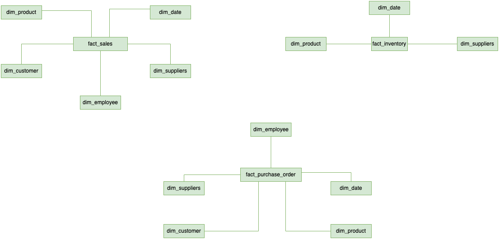
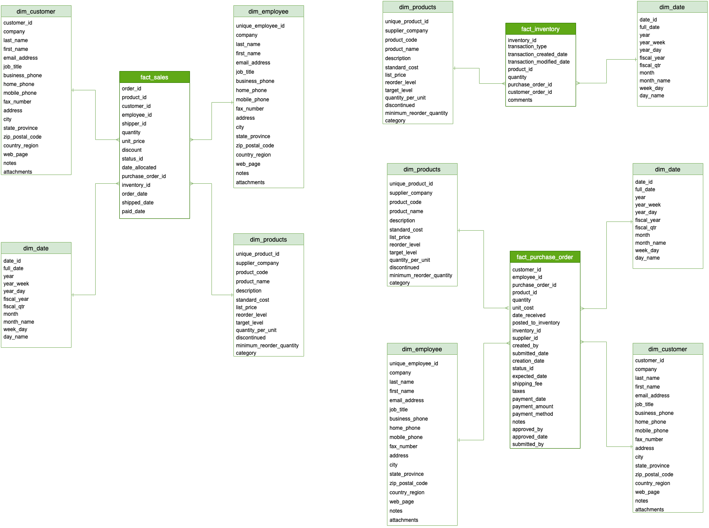
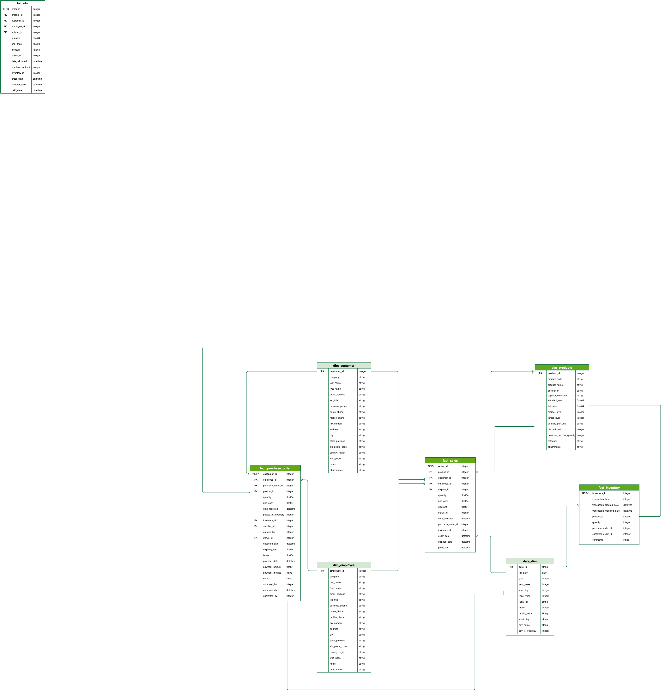

# Northwind Database OLTP to OLAP Transformation: Leveraging Dimensional Modeling for Advanced Analytics
This project unlocks the power of advanced analytics and reporting by transforming an OLTP architecture into an efficient OLAP system. It Leverages the capabilities of DBT and BigQuery to implement dimensional modeling, and drive data-driven decision-making.

## Aim
To modernise data reporting solution for Northwind through DImensional Modeling.

## Unveiling OLAP for Northwind OLTP Database
<b>what is the current architechture?</b>

- Northwind traders are export import companies who trades special foods around the world
- This is a sample database created by microsoft to demonstrate the features of some of its products, and for training and tutorials.
- The existing architecture is a mix of on premise and legacy systems
- They use Mysql for their main sales daily transactions
- They use Mysql database to build and run reports which was not efficient as the analytical queries impacted the processing speed of the transactions system
 

<b>why the need for a new architechture?</b>

- For better scalability
- To improve reporting speed
- To reduce load on operational systems
- To improve data security through better access control
 

<b>How do we implement a new architechture?</b>

- Northwind traders can migrate existing database to GCP
- MySQL on-prem can be replaced by a fully managed cloud sql
- For reporting solutions, an OLAP data warehouse on GCP using Bigquery will be built
- Dimensional Datawarehouse will be built on bigquery using Kimballs approach with dim and fact tables
 

## Identifying Business Requirements
There are many business Processes that can be derived from North wind database through the E-R diagram. However, we will be focusing on three processes:
- <b>Sales Overview:</b> Overall sales reports to understand better our customers what is being sold, what sells the most where and what sales the least, the goal is to have a general overview of how the business is going
- <b>Product Inventory: </b>
Understand the current inventory levels how to improve stock managengent, what suppliers to we have how much is being purchased. This will allow to understand stock management and potentially broker better deals with suppliers
- <b>Customer Reporting: </b>
Allow customers to understand their purchase orders, how much and when are they buying, empowering them to make data driven decisions and utilize the data to join to their sales data.

### Identifying required tables from ERD

 
<li>Customers - Customers buy food from Northwind</li>
<li>Employees - Works for Northwind</li>
<li>Orders - Sales Order transactions taking place between the customers & Northwind</li>
<li>Order Details - Order Details for the Orders placed by customer</li>
<li>Inventory Transaction - Transaction details of each inventory</li>
<li>Products - Contains current Northwind products that customers can purchase</li>
<li>Shippers - Ships orders from Northwind to customers</li>
<li>Suppliers - Supply Northwind with required items</li>
<li>Invoices - Invoice created for each order</li>

### Proposed Data Warehouse Architecture

  
From the image below you can find the three layers created in Bigquery through DBT. They are identified by the "dbt prefix"
 

### Proposed Data Modelling Concepts
- <b>Conceptual Data Model</b>

  
- <b>Logical Data Model</b>

  
- <b>Physical Data Model</b>

  

### Results
- The new Data Warehouse uses Bigquery for analytics and Business Intelligence which is more efficient than previous MySQL system.
- The Reporting is built as One Big Table denormalised from Dimensional models
- Sales Overview, Product Inventory, and Customer Reporting processes can now be carried out effectively to draw out insights

### Getting started on dbt project
- Commands to install dbt and connect to bigquery <a href="">here</a>
- Commands to create tables and insert data <a href="">here</a>
- If you are not able to enable billing for Bigquery on your account, insert data manually by uploading csv files located <a href="">here</a>

### Resources:
- Learn more about dbt [in the docs](https://docs.getdbt.com/docs/introduction)
- Check out [Discourse](https://discourse.getdbt.com/) for commonly asked questions and answers
- Join the [chat](https://community.getdbt.com/) on Slack for live discussions and support
- Find [dbt events](https://events.getdbt.com) near you
- Check out [the blog](https://blog.getdbt.com/) for the latest news on dbt's development and best practices
